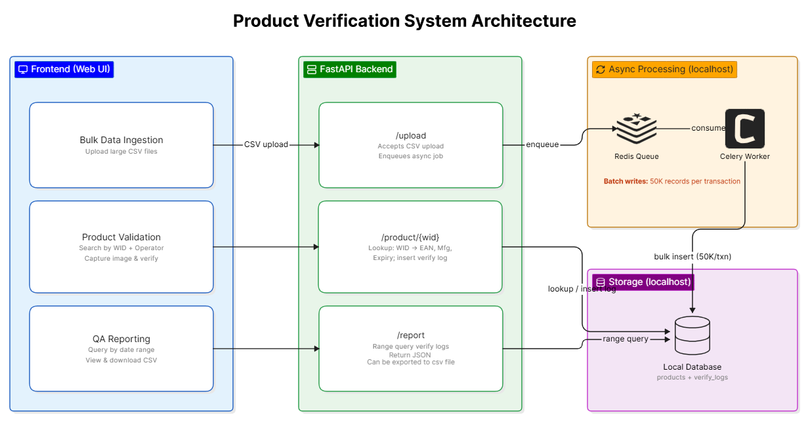
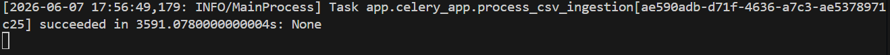
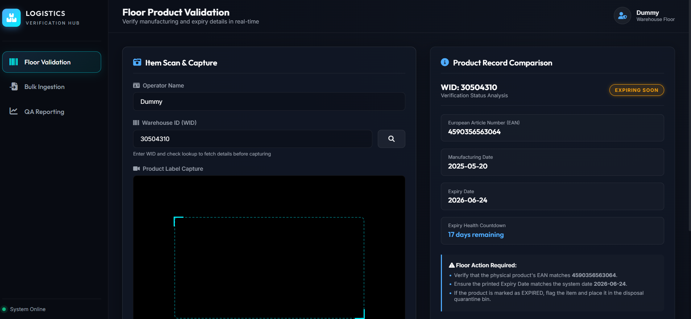
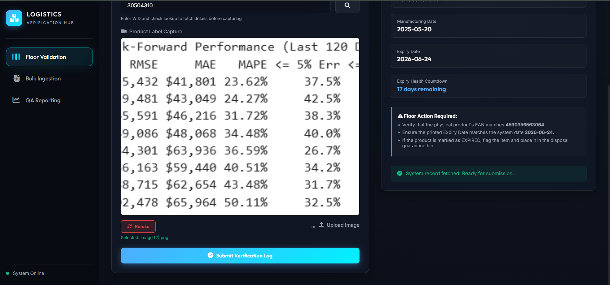
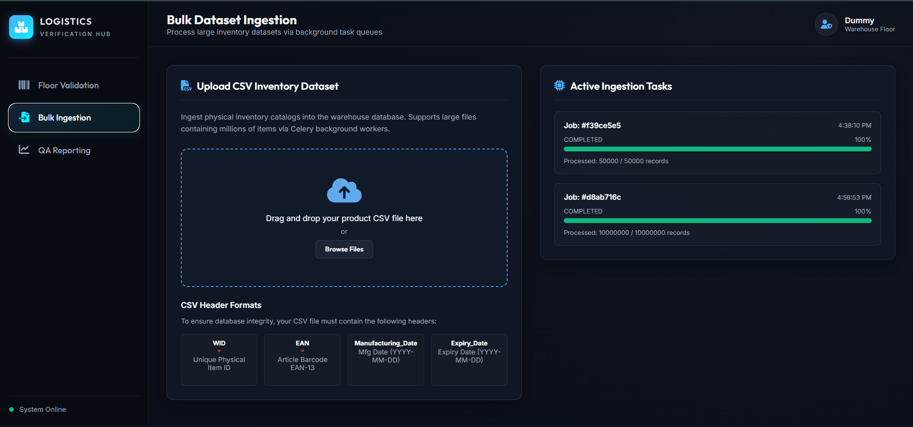
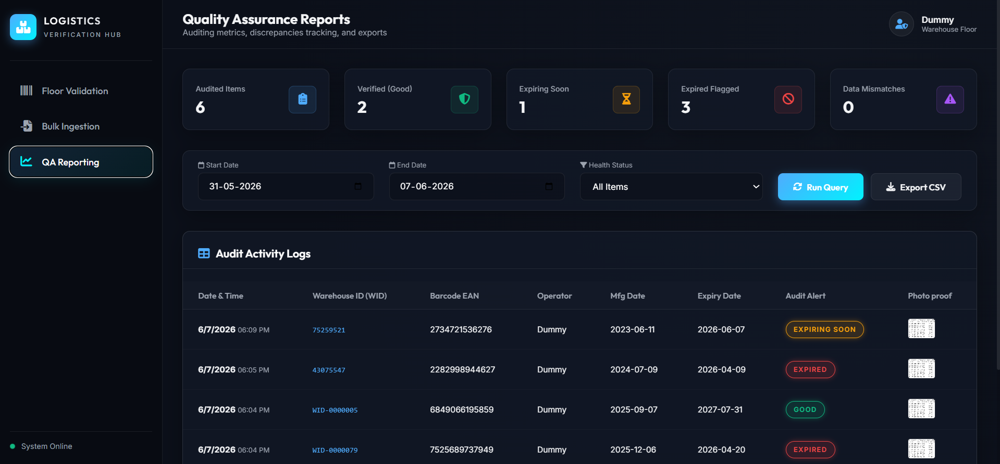
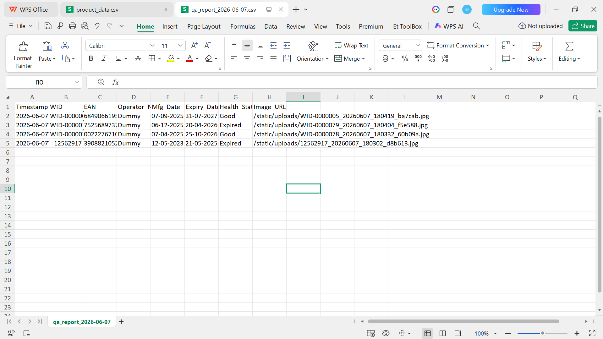

# ())Logistics - Product Verification System

Logistics Verification Hub is a high-performance warehouse management companion system. It supports bulk ingestion of catalog datasets, physical barcode/expiry verification on the warehouse floor via mobile/desktop webcam capture, and comprehensive QA compliance auditing.

---

### Architecture Diagram



## Key Features

1. **High-Speed Bulk Ingestion**:

   - Parses millions of catalog entries via line-by-line reading to maintain a tiny memory footprint (<20MB RAM).
   - Utilizes optimized SQLite SQLite `WITHOUT ROWID` indexing and structured batch-commits of 50,000 items to achieve >50,000 rows/second insertion rates.
   - Decoupled asynchronous uploads utilizing **Celery**.
2. **Floor Verification Scanner**:

   - Fetches product details (EAN, Mfg/Expiry dates) dynamically by Warehouse ID (WID) with under **20ms query latency**.
   - Integrates HTML5 MediaDevices camera API for snapping photos of printed physical product labels.
   - Automatically caches the active operator's name locally using `localStorage` for improved UX.
3. **QA Audit Reports & Analytics**:

   - Generates date-range activity reports detailing scanned records, warning thresholds, data discrepancies, and links to photo proof.
   - Supports client-side sorting, status filtering, and dynamic CSV downloads.
4. **Zero-Configuration Fallbacks**:

   - **No Redis?** Celery task execution falls back to synchronous eager execution mode automatically.
   - **No AWS S3?** Snapped verification images automatically save to the local filesystem (`app/static/uploads`) under a static mount.

---

## Tech Stack

- **Backend**: FastAPI, Uvicorn, SQLite3, Pydantic, Celery.
- **Storage & Services**: AWS S3 (`boto3` client), Redis (Celery Broker).
- **Frontend**: Vanilla HTML5, CSS3 (Glassmorphic dark design system), Vanilla JavaScript.
- **Development & Testing**: `requests` for API performance testing, `aiofiles` for async file writing, `uv` for python environment tracking.

---

## Directory Structure

```
Flipkart Task/
├── app/
│   ├── static/               # Frontend Assets
│   │   ├── css/styles.css    # Premium glassmorphic styles
│   │   ├── js/app.js         # Camera, polling, and data grid interactions
│   │   └── index.html        # App dashboard layout
│   ├── routers/              # API Endpoints
│   │   ├── Ingestion.py       # CSV upload & polling
│   │   ├── reporting.py      # QA metrics & audit queries
│   │   └── validation.py     # Product lookup & photo validation
│   ├── celery_app.py         # Celery background tasks definition
│   ├── config.py             # Server and storage configurations
│   ├── crud.py               # Optimized database transactions
│   ├── db.py                 # SQLite WAL connection pool setup
│   ├── main.py               # FastAPI router mounting & initializations
│   └── schemas.py            # Pydantic data schemas
├── data/                     # Database files and temp directory
├── tests/
│   ├── generate_test_csv.py  # Mock data CSV catalog generator
│   └── perf_test.py          # Automated latency & performance test suite
├── requirements.txt          # Python dependencies
├── run.py                    # Server startup script
├── start.bat                 # One-click launcher (Windows)
├── start.sh                  # One-click launcher (Bash / WSL)
└── README.md                 # Project documentation
```

---

## Local Setup & Installation

Follow these steps to configure and run the application locally on Windows:

### 1. Prerequisites

- Python 3.10 or higher.
- Redis (Optional; the application operates perfectly in Eager fallback mode without it).

### 2. Create Virtual Environment

Open PowerShell or Command Prompt at the project root and create a virtual environment:

```powershell
python -m venv .venv
.venv\Scripts\activate
```

### 3. Install Dependencies

Install all package requirements:

```powershell
pip install -r requirements.txt
```

### 4. Configuration (Optional `.env`)

You can configure environment variables by creating a `.env` file in the root directory:

```ini
# Database Path
DATABASE_PATH=data/inventory.db

# Redis/Celery Configuration
CELERY_BROKER_URL=redis://localhost:6379/0
CELERY_RESULT_BACKEND=redis://localhost:6379/0

# AWS S3 Settings (Falls back to local filesystem if blank)
AWS_ACCESS_KEY_ID=your_access_key_id
AWS_SECRET_ACCESS_KEY=your_secret_access_key
AWS_S3_BUCKET=your_s3_bucket_name
AWS_DEFAULT_REGION=us-east-1
```

---

## Running the Application

### Option A: Quick Start (Eager Fallback Mode - No Redis Required)

Simply launch the FastAPI server. Background operations will process synchronously on the main thread:

```powershell
python run.py
```

Visit the web dashboard at: **`http://localhost:8000/`**

### Option B: Production Stack (Async Mode - Redis Required) [Recommended]

1. Ensure your Redis server is running locally on port `6379` (make sure you have docker running)[For windows use docker for redis setup as redis is not natively supported on windows].

   ```
   docker run -d --name redis -p 6379:6379 redis
   ```
2. Start the Celery Worker process in a separate terminal:

   ```powershell
   .venv\Scripts\activate
   celery -A app.celery_app worker --loglevel=info -P threads
   ```
3. Start the FastAPI application server:

   ```powershell
   python run.py
   ```

### Option C: Single Script Launcher (Redis + Celery + App)

Launch the entire stack — Redis, Celery worker, and FastAPI server — with a single command. The script handles startup order, health checks, and cleans up all background processes when you press `Ctrl+C`.

**Windows (Command Prompt / PowerShell):**

```powershell
.\start.bat
```

Redis will work with docker in windows this script will skip redis and you have to manually run docker desktop (with redis image) to use async processing of data.

**Bash (WSL / Git Bash / Linux / macOS):**

```bash
bash start.sh
```

> **Note:** If Redis is not installed, the scripts will log a warning and continue — Celery will automatically fall back to synchronous eager mode, so everything still works.

***Highly Recommended to use Redis (For fast background processing)***

---

## Running Automated Tests

A performance test suite is provided to test bulk database imports, query latency, image upload, and compliance report retrieval.

1. Start the FastAPI server (`python run.py`) in one window.
2. In a second window (with virtualenv activated), run the tests:
   ```powershell
   python tests/perf_test.py
   ```

The test runner will:

- Generate a test inventory file containing **50,000 mock products** in `data/test_inventory.csv`.
- Upload the CSV file to the ingestion endpoint and measure the processing speed.
- Validate primary key lookup speeds for various records.
- Submit a mock physical verification event, complete with label image upload.
- Fetch the QA Audit Report for verification.

**Note -** **Currently not using S3 (Not added creds for S3) instead storing images locally but have integrated S3.**

***RESULTS:***

***Time taken by the system to upload/process product_data.csv file (438MB) using my current laptop resources was - 3591 secs***



***Few Screenshots***

**Product Record fetching**



**Product validation and Submission for verification log**



**Bulk data ingestion**



**QA Report Query Run**



**QA Report Exported to CSV file**


